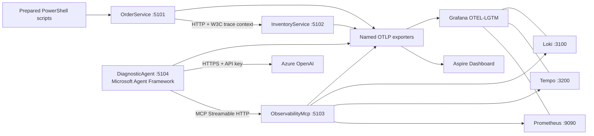

# Architecture

## Components

## Launch model

`Demo.AppHost` starts all .NET projects and the pinned LGTM container. Aspire injects
the authenticated OTLP endpoint for its built-in Dashboard. The AppHost also injects
the LGTM endpoints and application-to-application URLs.

## Telemetry routing

`Demo.ServiceDefaults` registers named OTLP exporters for logs, metrics and traces:

- Aspire exporter: gRPC to the Dashboard managed by AppHost;
- LGTM exporter: HTTP/protobuf to the Docker container managed by AppHost.

This avoids `UseOtlpExporter`, which cannot be combined with multiple signal-specific
exporters.

## Runtime flow

1. `POST /orders` receives a SKU and quantity.
2. OrderService creates `order.process` and calls InventoryService.
3. `DEMO-FAST` completes in about 25 ms.
4. `VOLCAMP-63` makes InventoryService wait 2500 ms.
5. OrderService times out after 700 ms and retries twice.
6. All three attempts share the order trace through automatic `HttpClient`
   instrumentation.
7. The diagnostic agent queries telemetry using five MCP tools and returns evidence,
   confidence and a suggested human action.
